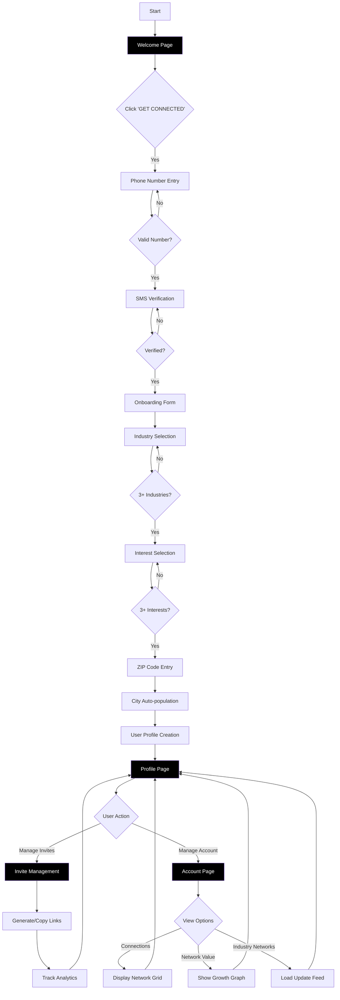
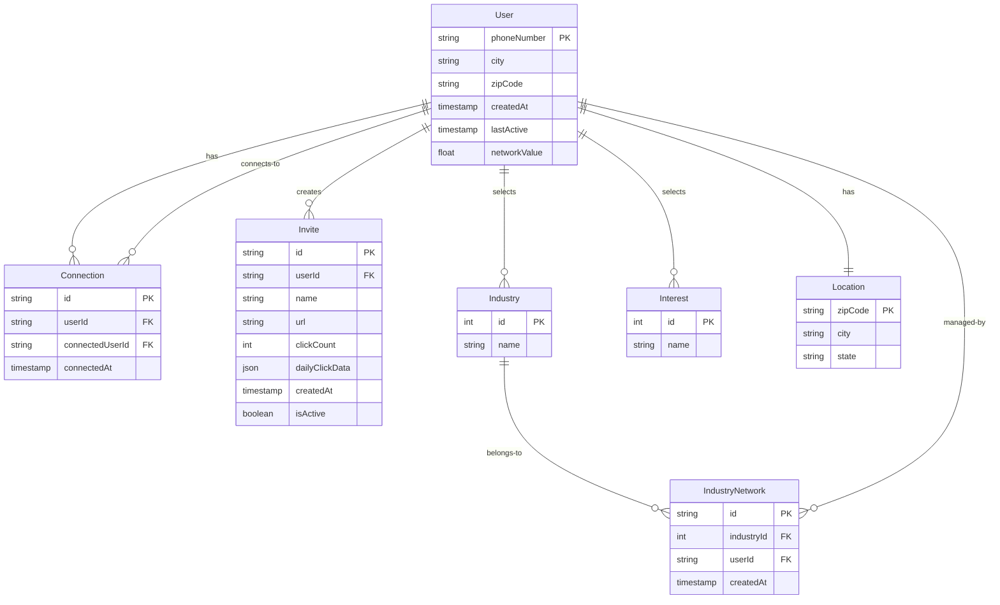
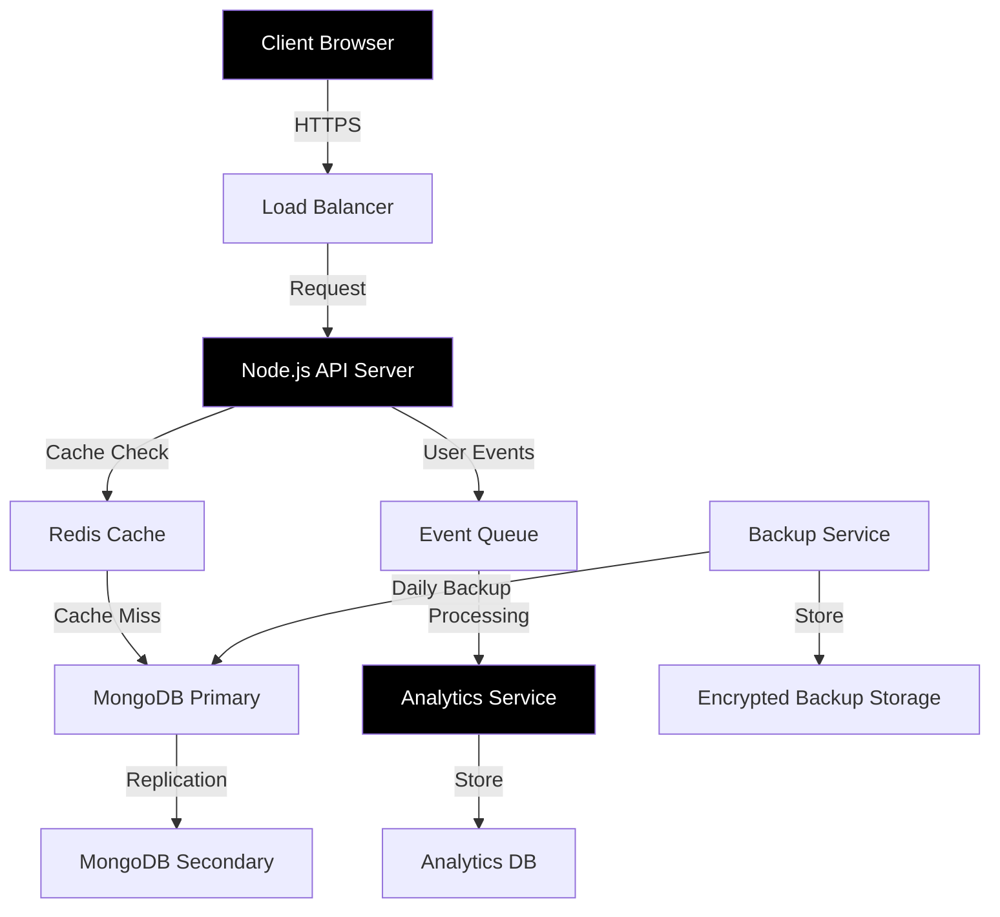
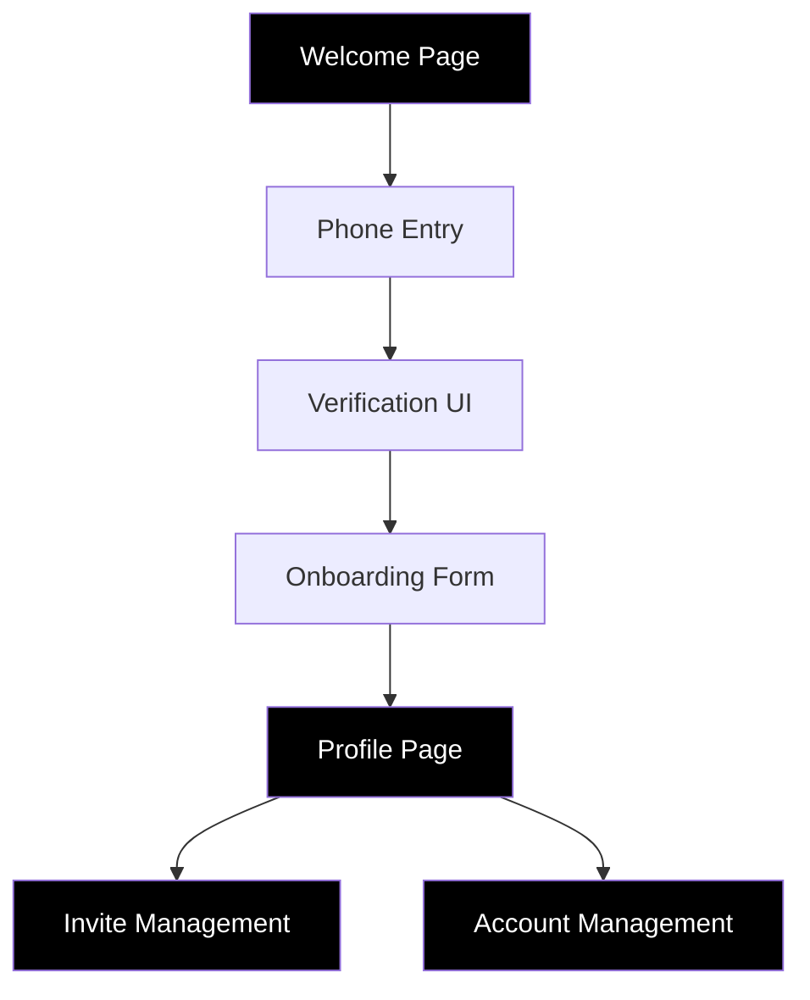

# 1. Introduction

## 1.1 Purpose

This Software Requirements Specification (SRS) document provides a comprehensive description of the Pollen8 web platform. It is intended for:
- Development team members implementing the system
- UI/UX designers creating the user interface
- Project managers overseeing development
- Quality assurance testers validating functionality
- Stakeholders evaluating project scope and features

The document outlines functional and non-functional requirements, user interface specifications, and technical constraints to ensure all parties have a clear understanding of the project deliverables.

## 1.2 Scope

Pollen8 is a professional networking web platform built using React.js, Node.js, Tailwind CSS, and D3.js. The platform's core functionalities include:

- User onboarding and verification via phone number
- Industry and interest-based profile creation
- Location-aware user profiles
- Network visualization and management
- Invite system with trackable links and analytics
- Network value calculation and display

Key benefits:
- Minimalist, modern black and white interface design
- Smooth animations and responsive interactions
- Data-driven network growth tracking
- Industry-specific networking capabilities

The platform aims to:
1. Facilitate meaningful professional connections
2. Provide quantifiable network value metrics
3. Enable targeted networking within specific industries
4. Offer detailed analytics on network growth and engagement

# 2. Product Description

## 2.1 Product Perspective

Pollen8 operates as a standalone web application within the professional networking ecosystem. While it interfaces with existing systems for phone verification and location services, it maintains its unique position through:

- Independent user data management and storage
- Proprietary network value calculation algorithms
- Custom visualization engine built on D3.js
- RESTful API architecture enabling future third-party integrations
- Responsive web design supporting desktop and mobile browsers

The system architecture follows a client-server model:
- Front-end: React.js with Tailwind CSS
- Back-end: Node.js RESTful API
- Data Visualization: D3.js
- Database: NoSQL for flexible user profile and network data storage

## 2.2 Product Functions

1. User Authentication and Verification
   - Phone number-based registration
   - SMS verification system
   - Secure session management

2. Profile Management
   - Industry selection (minimum 3)
   - Interest tagging (minimum 3)
   - Location-based user grouping
   - Dynamic profile updates

3. Network Visualization and Analytics
   - Interactive network graphs using D3.js
   - Real-time network value calculation
   - Industry-specific network views
   - Connection growth tracking

4. Invite System
   - Unique invite link generation
   - Click tracking and analytics
   - Visual activity reporting
   - Automated URL copying

5. Account Management
   - Network value monitoring
   - Industry network creation and management
   - Connection browsing and filtering
   - Culture-focused update feeds

## 2.3 User Characteristics

1. Primary User Persona: Professional Networker
   - Age: 25-45
   - Tech-savvy professionals
   - Values data-driven networking
   - Seeks industry-specific connections

2. Secondary User Persona: Industry Influencer
   - Established in their field
   - Manages large professional networks
   - Requires detailed analytics
   - Creates and manages multiple industry networks

Expected user expertise:
- Basic digital literacy
- Familiarity with professional networking concepts
- Comfort with minimalist interfaces
- Understanding of basic analytics

## 2.4 Constraints

1. Technical Constraints
   - Browser compatibility limited to modern versions
   - Mobile responsiveness required for all features
   - Real-time data visualization performance limitations
   - API rate limiting for third-party services

2. Design Constraints
   - Strict black and white color palette
   - Proxima Nova font family requirement
   - Specific animation timing requirements
   - Consistent button styling across all pages

3. Operational Constraints
   - Phone verification required for all users
   - Minimum of 3 industries and interests per user
   - Limited to supported geographic regions
   - Network value calculation fixed at 3.14 per connection

## 2.5 Assumptions and Dependencies

Assumptions:
1. Users have consistent internet access
2. Users own smartphones capable of receiving SMS
3. Users are willing to provide phone numbers for verification
4. Modern web browsers support required JavaScript features

Dependencies:
1. External Services
   - SMS verification service availability
   - Geolocation API for city detection
   - CDN for font delivery

2. Technical Dependencies
   - React.js framework
   - Node.js runtime environment
   - D3.js library for visualizations
   - Tailwind CSS framework

3. Data Dependencies
   - Industry classification system
   - Interest categorization database
   - ZIP code to city mapping database

# 3. Process Flowchart

## 3.1 Technical Implementation Notes

1. React.js Components:
   - Welcome component with text animation using CSS transitions
   - Phone verification component with state management
   - Form components with validation logic
   - D3.js integration for network visualization

2. Node.js Backend Processes:
   - SMS verification service integration
   - User data persistence
   - Network value calculation (3.14 per connection)
   - Analytics tracking for invite links

3. Data Flow:
   - Client-side form validation before API calls
   - Real-time updates for network changes
   - Asynchronous loading of network visualizations
   - WebSocket connections for live analytics

4. State Management:
   - User session handling
   - Form data persistence between steps
   - Network data caching for performance
   - Real-time updates for invite analytics

# 4. Functional Requirements

## 4.1 User Authentication and Verification

### ID: F-001

### Description
Phone number-based user authentication system with SMS verification to ensure secure and verified access to the platform.

### Priority
High

### Functional Requirements

| ID | Requirement | Description |
|----|-------------|-------------|
| F-001.1 | Phone Number Entry | System shall provide an input field for users to enter their phone number with automatic formatting |
| F-001.2 | Number Validation | System shall validate phone numbers for correct format and existence before sending verification code |
| F-001.3 | SMS Verification | System shall generate and send a unique verification code via SMS to the provided phone number |
| F-001.4 | Code Verification | System shall verify the entered code against the generated code within a 5-minute timeframe |
| F-001.5 | Session Management | System shall create and maintain a secure user session upon successful verification |
| F-001.6 | Re-verification | System shall provide option to resend verification code after 60 seconds |

## 4.2 Profile Management

### ID: F-002

### Description
Comprehensive profile creation and management system allowing users to define their professional identity through industries, interests, and location.

### Priority
High

### Functional Requirements

| ID | Requirement | Description |
|----|-------------|-------------|
| F-002.1 | Industry Selection | System shall provide a dropdown with multiple industry options, requiring minimum 3 selections |
| F-002.2 | Interest Selection | System shall provide a dropdown with multiple interest options, requiring minimum 3 selections |
| F-002.3 | Location Setting | System shall accept ZIP code input and auto-populate city information |
| F-002.4 | Profile Visualization | System shall display user profile with selected industries, interests, and location in a metadata grid |
| F-002.5 | Profile Updates | System shall allow users to modify their profile information after initial creation |
| F-002.6 | Data Validation | System shall validate all profile inputs before saving to ensure data integrity |

## 4.3 Network Visualization

### ID: F-003

### Description
Interactive visualization of user networks using D3.js, providing insights into connections and network value.

### Priority
Medium

### Functional Requirements

| ID | Requirement | Description |
|----|-------------|-------------|
| F-003.1 | Connection Display | System shall display user connections in a responsive grid layout |
| F-003.2 | Network Value Calculation | System shall calculate network value at 3.14 per connection |
| F-003.3 | Growth Tracking | System shall generate and display a line graph showing network growth over the past year |
| F-003.4 | Industry Networks | System shall categorize and display connections by industry |
| F-003.5 | Interactive Visualization | System shall provide interactive elements in network visualizations using D3.js |
| F-003.6 | Real-time Updates | System shall update network visualizations in real-time as connections change |

## 4.4 Invite System

### ID: F-004

### Description
Comprehensive invite management system allowing users to generate, track, and analyze invitation links.

### Priority
Medium

### Functional Requirements

| ID | Requirement | Description |
|----|-------------|-------------|
| F-004.1 | Link Generation | System shall generate unique, trackable invitation links |
| F-004.2 | Link Management | System shall provide interface to name, create, and delete invitation links |
| F-004.3 | Click Tracking | System shall track and display the number of clicks for each invitation link |
| F-004.4 | Analytics Visualization | System shall display 30-day activity graphs for each invitation link using D3.js |
| F-004.5 | URL Copying | System shall provide one-click copying of invitation URLs to clipboard |
| F-004.6 | Link Listing | System shall display all generated links in a sortable, three-column format |

## 4.5 User Interface

### ID: F-005

### Description
Responsive, black and white interface with smooth animations and consistent styling across all pages.

### Priority
High

### Functional Requirements

| ID | Requirement | Description |
|----|-------------|-------------|
| F-005.1 | Responsive Design | System shall adapt layout and functionality across different screen sizes |
| F-005.2 | Animation Implementation | System shall implement specified animations for text, buttons, and transitions |
| F-005.3 | Consistent Styling | System shall maintain consistent black and white color scheme and Proxima Nova font |
| F-005.4 | Button Design | System shall implement buttons with 50% left-side border radius and specified color schemes |
| F-005.5 | Form Styling | System shall style form fields with 3px white borders and centered, capitalized placeholder text |
| F-005.6 | Navigation | System shall provide intuitive navigation between all five main pages |

# 5. Non-Functional Requirements

## 5.1 Performance

| ID | Requirement | Description | Metric |
|----|-------------|-------------|--------|
| P-001 | Page Load Time | Initial page load time for any route | ≤ 2 seconds |
| P-002 | API Response Time | Server response time for API requests | ≤ 500ms |
| P-003 | Network Visualization Rendering | Time to render D3.js network graphs | ≤ 1 second |
| P-004 | Concurrent Users | System shall support concurrent active users | Minimum 10,000 |
| P-005 | Database Query Time | Maximum time for database operations | ≤ 100ms |
| P-006 | Client-side Memory Usage | Maximum browser memory usage | ≤ 100MB |

## 5.2 Safety

| ID | Requirement | Description |
|----|-------------|-------------|
| S-001 | Data Backup | Automated daily backups with 30-day retention |
| S-002 | Failover System | Redundant server configuration with automatic failover |
| S-003 | Data Recovery | Recovery Point Objective (RPO) of 1 hour |
| S-004 | Error Handling | Graceful degradation of features during partial system failure |
| S-005 | User Notification | Immediate notification to users during system downtime |
| S-006 | Transaction Integrity | Atomic transactions for all data modifications |

## 5.3 Security

| ID | Requirement | Description |
|----|-------------|-------------|
| SE-001 | Data Encryption | All data in transit and at rest must be encrypted using industry-standard protocols (TLS 1.3, AES-256) |
| SE-002 | Authentication | Phone number verification with rate limiting (max 5 attempts per hour) |
| SE-003 | Session Management | JWT tokens with 24-hour expiration and secure httpOnly cookies |
| SE-004 | API Security | Implementation of CORS, CSP headers, and API rate limiting |
| SE-005 | Data Privacy | Compliance with GDPR and CCPA data privacy requirements |
| SE-006 | Vulnerability Scanning | Weekly automated security scans using industry-standard tools |

## 5.4 Quality

### 5.4.1 Availability
- System uptime of 99.9% excluding scheduled maintenance
- Maximum scheduled downtime of 4 hours per month
- Redundant infrastructure across multiple availability zones

### 5.4.2 Maintainability
- Modular React.js component architecture
- Comprehensive API documentation using OpenAPI 3.0
- Automated CI/CD pipeline for deployment
- Code coverage minimum of 80% for unit tests

### 5.4.3 Usability
- Interface compliant with WCAG 2.1 Level AA standards
- Maximum of 3 clicks to reach any feature
- Consistent black and white design across all pages
- Support for keyboard navigation

### 5.4.4 Scalability
- Horizontal scaling capability for Node.js backend
- Microservices architecture for independent scaling
- CDN implementation for static assets
- Database sharding capability for user data

### 5.4.5 Reliability
- Mean Time Between Failures (MTBF): 720 hours
- Mean Time To Repair (MTTR): 2 hours
- Error rate less than 0.1% for all API endpoints
- Automated system health checks every 5 minutes

## 5.5 Compliance

| ID | Requirement | Description |
|----|-------------|-------------|
| C-001 | Data Protection | Compliance with GDPR and CCPA regulations |
| C-002 | Accessibility | WCAG 2.1 Level AA compliance for all user interfaces |
| C-003 | Security Standards | SOC 2 Type II certification for data handling |
| C-004 | Phone Number Handling | Compliance with international telecommunication regulations |
| C-005 | Terms of Service | Clear display and user acceptance of terms and privacy policy |
| C-006 | Data Retention | Implementation of data retention and deletion policies |

# 6. Data Requirements

## 6.1 Data Models

## 6.2 Data Storage

### 6.2.1 Database Selection
- Primary Database: MongoDB NoSQL database for flexible schema and scalability
- Caching Layer: Redis for high-performance data caching and session management

### 6.2.2 Data Retention
1. User Data
   - Active user profiles retained indefinitely
   - Inactive accounts archived after 12 months
   - Archived data retained for 24 months before permanent deletion

2. Connection Data
   - All connection history preserved
   - Metadata about removed connections kept for analytics

3. Invite Data
   - Active invites retained indefinitely
   - Expired/used invites archived after 90 days
   - Click analytics data aggregated after 30 days

### 6.2.3 Redundancy and Backup
1. Database Replication
   - Primary-Secondary replication with 3 nodes
   - Automatic failover configuration
   - Cross-region replication for disaster recovery

2. Backup Strategy
   - Daily incremental backups
   - Weekly full backups
   - 30-day backup retention period
   - Encrypted backups stored in multiple geographic regions

3. Recovery Procedures
   - Recovery Time Objective (RTO): 1 hour
   - Recovery Point Objective (RPO): 5 minutes
   - Automated recovery testing performed monthly

## 6.3 Data Processing

### 6.3.1 Data Flow

### 6.3.2 Data Security

1. Encryption
   - Data at rest: AES-256 encryption
   - Data in transit: TLS 1.3
   - Encryption key rotation every 90 days

2. Access Control
   - Role-based access control (RBAC)
   - JWT tokens for API authentication
   - IP whitelisting for database access

3. Data Sanitization
   - Input validation on all API endpoints
   - XSS prevention through content sanitization
   - SQL injection protection via parameterized queries

### 6.3.3 Real-time Processing
1. Network Value Calculation
   - Triggered on connection changes
   - Cached results updated in Redis
   - Batch processing for large networks

2. Analytics Processing
   - Real-time click tracking for invites
   - Aggregation of network metrics every 5 minutes
   - Daily rollup of user activity data

### 6.3.4 Data Integrity
1. Validation
   - Schema validation for all database operations
   - Referential integrity checks for connections
   - Duplicate prevention for user profiles

2. Consistency
   - Two-phase commit for critical transactions
   - Eventual consistency model for non-critical updates
   - Conflict resolution for concurrent modifications

# 7. External Interfaces

## 7.1 User Interfaces

### 7.1.1 General Requirements
- Responsive design supporting screen sizes from 320px to 4K resolution
- Black (#000000) background with white (#FFFFFF) text and UI elements
- Proxima Nova font family for all text elements
- Smooth animations with specified timings for transitions
- WCAG 2.1 Level AA compliance for accessibility

### 7.1.2 Interface Components

| Component | Description | Specifications |
|-----------|-------------|----------------|
| Buttons | Interactive elements for user actions | - 50% left-side border radius - White background with black text for primary actions - Black background with white text for secondary actions - Capitalized text, 16px size |
| Form Fields | Input elements for data entry | - 3px white border - Centered, capitalized placeholder text - Dark gray placeholder color - Black background |
| Dropdowns | Selection menus for multiple options | - Custom styling matching form fields - Checkbox functionality for multi-select - Scrollable with keyboard navigation |
| Graphs | D3.js visualizations | - Black and white color scheme - Interactive hover states - Responsive sizing - Smooth animations for data updates |

### 7.1.3 Page-Specific Elements

## 7.2 Software Interfaces

### 7.2.1 Frontend Framework
- React.js 18.0 or higher
- Dependencies:
  - Tailwind CSS 3.0 or higher for styling
  - D3.js 7.0 or higher for data visualization
  - React Router 6.0 or higher for navigation

### 7.2.2 Backend Services

| Service | Purpose | Interface Type |
|---------|---------|----------------|
| Node.js API | Primary application server | RESTful API endpoints |
| SMS Gateway | Phone verification service | HTTPS API with JSON payload |
| Geolocation Service | ZIP code to city conversion | RESTful API with rate limiting |
| CDN | Static asset delivery | HTTP/HTTPS content delivery |

### 7.2.3 Database Interfaces
- MongoDB driver for Node.js
  - Connection pooling
  - Replica set support
  - Automatic reconnection
- Redis client for caching
  - Pub/Sub capabilities
  - Connection timeout handling

## 7.3 Communication Interfaces

### 7.3.1 Network Protocols
- HTTPS for all client-server communication
- WebSocket for real-time updates
- HTTP/2 for improved performance

### 7.3.2 API Specifications

| Endpoint Category | Format | Authentication |
|-------------------|--------|----------------|
| User Management | REST/JSON | JWT tokens |
| Network Operations | REST/JSON | JWT tokens |
| Analytics | REST/JSON | JWT tokens |
| Real-time Updates | WebSocket | JWT tokens |

### 7.3.3 Data Formats
- All API requests and responses in JSON format
- UTF-8 encoding for all text data
- ISO 8601 for date/time values
- Base64 encoding for binary data transmission

### 7.3.4 Communication Security
- TLS 1.3 for all HTTPS connections
- CORS configuration for API endpoints
- Rate limiting per IP and user
- API versioning for backward compatibility

## 7.4 Hardware Interfaces

### 7.4.1 Client Devices
- Modern web browsers on desktop and mobile devices
- Minimum requirements:
  - HTML5 support
  - JavaScript enabled
  - WebSocket support
  - Local storage capability

### 7.4.2 Server Hardware
- Load balancers
  - Health check endpoints
  - SSL termination
- Application servers
  - CPU monitoring for auto-scaling
  - Memory usage tracking
- Database servers
  - Disk I/O optimization
  - Network latency monitoring

### 7.4.3 Monitoring Interfaces
- Server metrics collection
  - CPU, memory, disk usage
  - Network throughput
- Application performance monitoring
  - Response time tracking
  - Error rate monitoring
- Real-time alerting system
  - Hardware failure notifications
  - Performance degradation alerts

# 8. APPENDICES

## 8.1 Glossary

| Term | Definition |
|------|------------|
| Network Value | A numerical representation of a user's professional network worth, calculated at 3.14 per connection |
| Industry Network | A subset of a user's connections filtered by specific industry categories |
| Invite Link | A unique, trackable URL generated for users to invite others to the platform |
| Metadata Grid | A visual display of user profile information showing industries, interests, and location |
| Culture-focused Update Feed | A chronological stream of updates from connections within a specific industry network |
| Onboarding | The process of collecting essential user information through a multi-step form after phone verification |
| Profile Banner | A visual element at the top of the user profile displaying key information and a pulsing avatar |

## 8.2 Acronyms

| Acronym | Expanded Form |
|---------|---------------|
| API | Application Programming Interface |
| CORS | Cross-Origin Resource Sharing |
| CSP | Content Security Policy |
| GDPR | General Data Protection Regulation |
| CCPA | California Consumer Privacy Act |
| JWT | JSON Web Token |
| MTBF | Mean Time Between Failures |
| MTTR | Mean Time To Repair |
| RBAC | Role-Based Access Control |
| RPO | Recovery Point Objective |
| RTO | Recovery Time Objective |
| SMS | Short Message Service |
| TLS | Transport Layer Security |
| UI/UX | User Interface/User Experience |
| WCAG | Web Content Accessibility Guidelines |
| XSS | Cross-Site Scripting |

## 8.3 Additional References

1. Technical Documentation
   - React.js Official Documentation: https://reactjs.org/docs
   - D3.js Gallery and Examples: https://observablehq.com/@d3/gallery
   - Tailwind CSS Documentation: https://tailwindcss.com/docs
   - Node.js Best Practices: https://github.com/goldbergyoni/nodebestpractices

2. Design Resources
   - Proxima Nova Font Family: https://fonts.adobe.com/fonts/proxima-nova
   - Web Accessibility Initiative (WAI): https://www.w3.org/WAI/
   - Animation Timing Functions: https://easings.net/

3. Security Standards
   - OWASP Web Security Testing Guide: https://owasp.org/www-project-web-security-testing-guide/
   - GDPR Compliance Checklist: https://gdpr.eu/checklist/

4. Performance Optimization
   - Web Vitals: https://web.dev/vitals/
   - React Performance Optimization: https://reactjs.org/docs/optimizing-performance.html

## 8.4 Testing Requirements

1. Unit Testing
   - Framework: Jest with React Testing Library
   - Coverage requirement: 80% minimum
   - Critical paths requiring 100% coverage:
     - Phone verification flow
     - Network value calculation
     - Invite link generation

2. Integration Testing
   - API endpoint testing using Supertest
   - WebSocket connection testing
   - Database interaction verification

3. Performance Testing
   - Load testing scenarios:
     - Concurrent user simulation
     - Network visualization rendering
     - Real-time update handling
   - Tools: Apache JMeter, Lighthouse

4. Accessibility Testing
   - WCAG 2.1 Level AA compliance verification
   - Screen reader compatibility
   - Keyboard navigation testing

## 8.5 Deployment Checklist

1. Pre-deployment
   - [ ] All unit tests passing
   - [ ] Integration tests completed
   - [ ] Performance benchmarks met
   - [ ] Security scan performed
   - [ ] Documentation updated

2. Deployment Process
   - [ ] Database migration scripts prepared
   - [ ] CDN cache invalidation planned
   - [ ] Zero-downtime deployment strategy confirmed
   - [ ] Rollback procedure documented

3. Post-deployment
   - [ ] Smoke tests executed
   - [ ] Monitoring alerts configured
   - [ ] Performance metrics baseline established
   - [ ] User feedback collection mechanism activated