# 1. Introduction

## 1.1 System Objectives

The Pollen8 platform aims to revolutionize professional networking through a minimalist, data-driven approach with the following key objectives:

| Objective | Description | Key Features |
|-----------|-------------|--------------|
| Verified Connections | Ensure authentic professional networking | - Phone number verification<br>- SMS-based authentication<br>- Real identity validation |
| Industry Focus | Enable targeted networking within specific sectors | - Multi-industry selection<br>- Industry-specific networks<br>- Categorized connection management |
| Quantifiable Networking | Provide measurable network growth and value | - Network value calculation (3.14 per connection)<br>- Growth tracking visualization<br>- Analytics-driven insights |
| User-Centric Design | Deliver an intuitive, modern user experience | - Black and white minimalist interface<br>- Smooth animations<br>- Responsive design across devices |

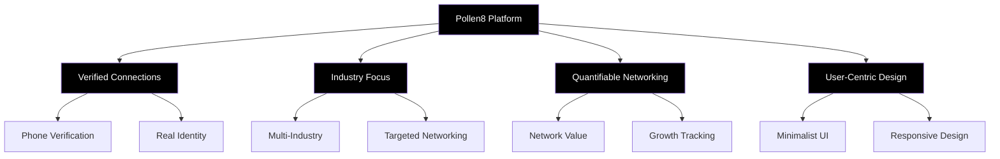

## 1.2 Scope

### Product Overview
Pollen8 is a web-based professional networking platform built using React.js, Node.js, Tailwind CSS, and D3.js, focusing on creating meaningful, industry-specific connections with quantifiable value.

### Core Functionalities

1. User Authentication and Profile Management
   - Phone number verification system
   - Multi-industry and interest selection
   - Location-aware user profiles

2. Network Management and Visualization
   - Interactive network graphs using D3.js
   - Industry-specific network creation
   - Network value calculation and tracking

3. Invitation System
   - Trackable invite link generation
   - Analytics visualization for invite performance
   - One-click link sharing

### Benefits

| Benefit | Description | Impact |
|---------|-------------|--------|
| Data-Driven Networking | Quantifiable network growth and value metrics | Enables users to measure and optimize their professional connections |
| Industry Specificity | Targeted networking within chosen sectors | Facilitates more relevant and valuable professional relationships |
| Enhanced Privacy | Phone verification and real identity focus | Reduces fake profiles and improves network quality |
| Modern User Experience | Minimalist design with intuitive interactions | Increases user engagement and platform adoption |

### Technical Scope

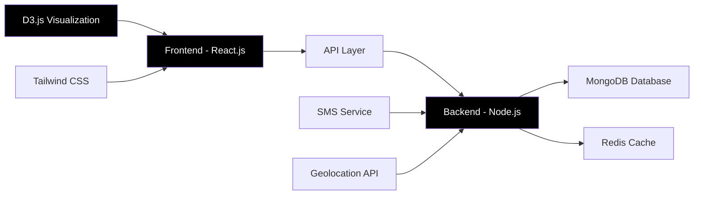

### Limitations and Constraints

1. Technical Constraints
   - Modern browser requirement
   - Internet connectivity dependency
   - Mobile device compatibility for SMS verification

2. Functional Constraints
   - Minimum of 3 industries and interests per user
   - Network value fixed at 3.14 per connection
   - Black and white design aesthetic

### Future Expansion Possibilities
- API for third-party integrations
- Advanced analytics and reporting
- Enhanced visualization options
- Mobile application development

# 2. SYSTEM ARCHITECTURE

## 2.1 PROGRAMMING LANGUAGES

| Language | Purpose | Justification |
|----------|---------|---------------|
| JavaScript (ES6+) | Frontend development with React.js | - Extensive ecosystem<br>- Native browser support<br>- Rich UI library availability<br>- Seamless integration with D3.js |
| TypeScript | Type-safe frontend and backend development | - Enhanced code reliability<br>- Better IDE support<br>- Improved maintainability<br>- Interface-driven development |
| Node.js | Backend server implementation | - JavaScript ecosystem consistency<br>- High performance for I/O operations<br>- Extensive package ecosystem (npm)<br>- Scalable architecture support |
| SQL | Database queries | - Data integrity for relational data<br>- Complex querying capabilities<br>- Transaction support |
| CSS (Tailwind) | Styling and UI implementation | - Utility-first approach<br>- Consistent design system<br>- Responsive design support |

## 2.2 HIGH-LEVEL ARCHITECTURE DIAGRAM

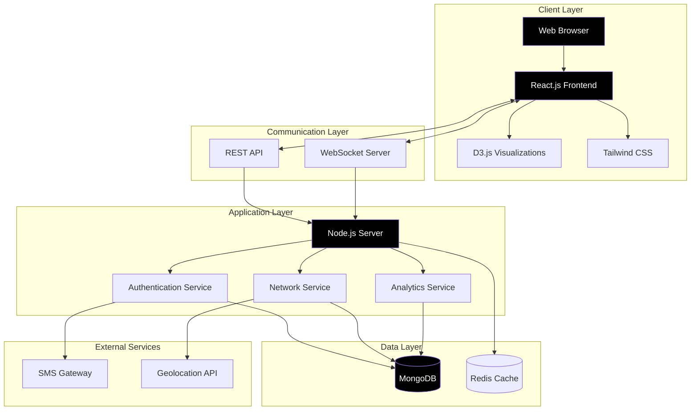

## 2.3 COMPONENT DIAGRAMS

### 2.3.1 Frontend Components

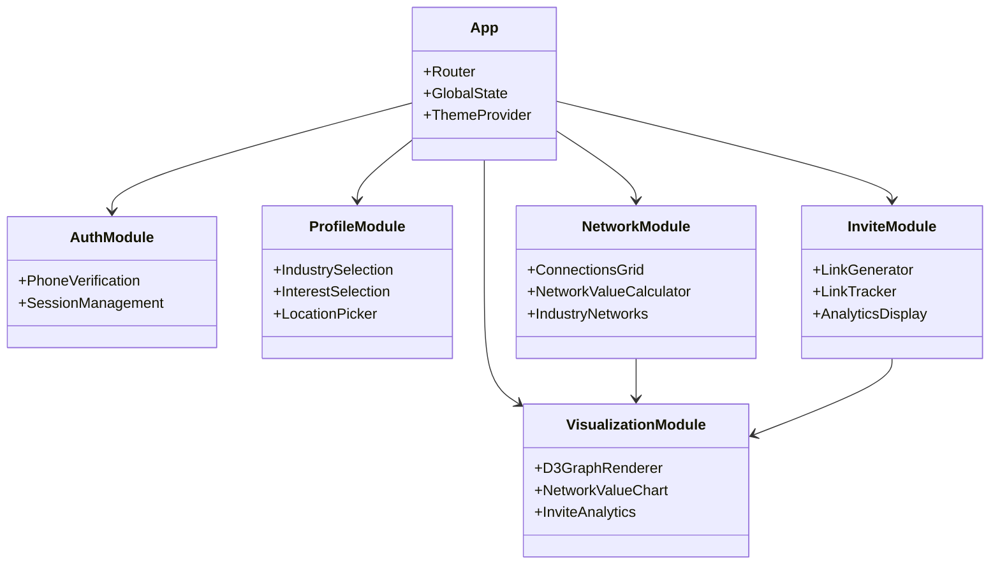

### 2.3.2 Backend Components

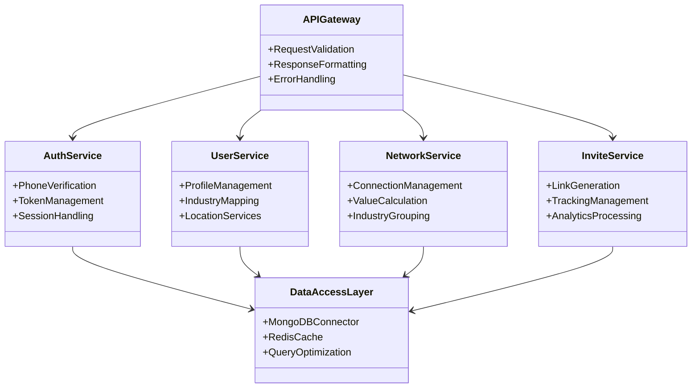

## 2.4 SEQUENCE DIAGRAMS

### 2.4.1 User Onboarding Flow

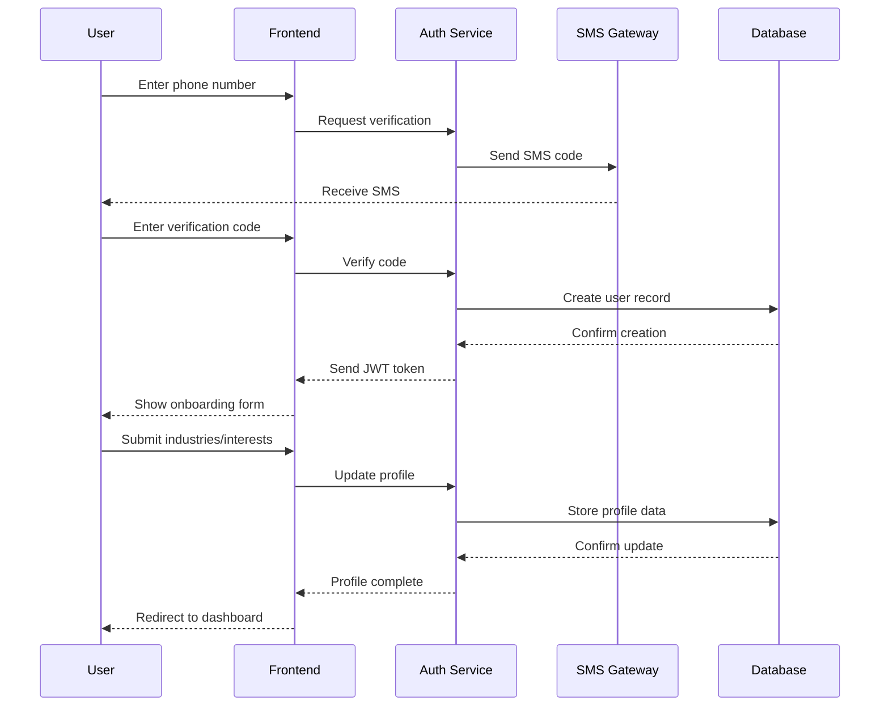

### 2.4.2 Network Value Calculation

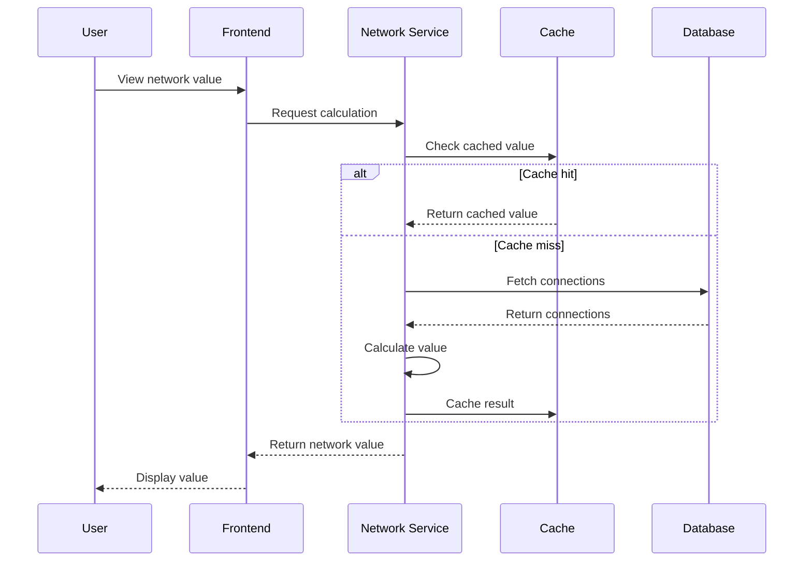

## 2.5 DATA-FLOW DIAGRAM

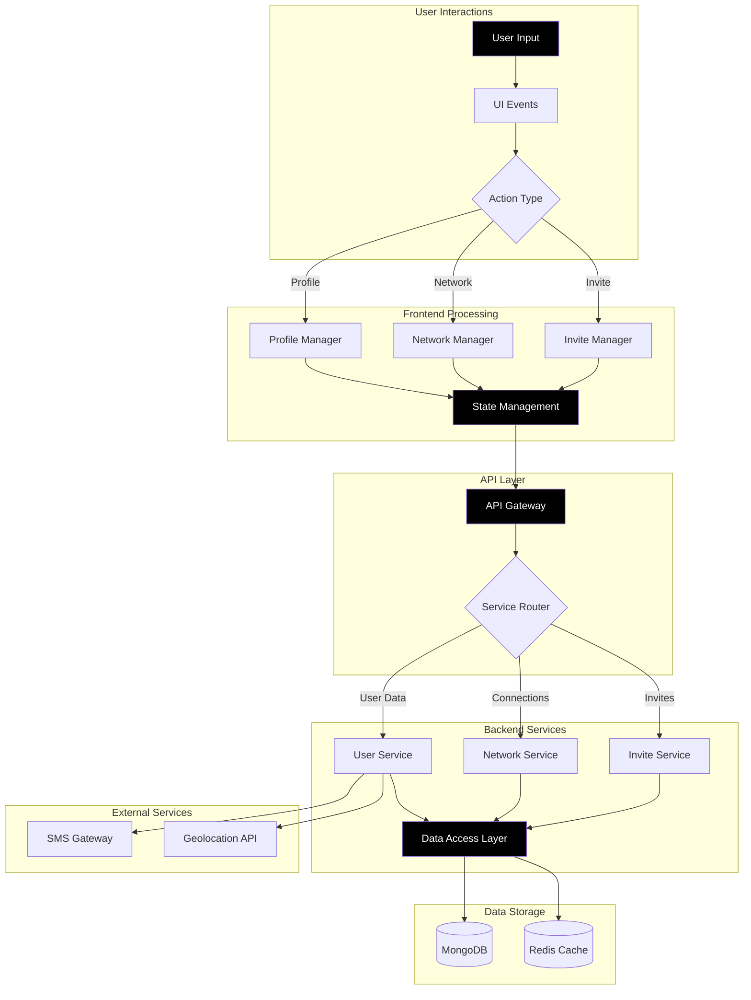

# 3. SYSTEM DESIGN

## 3.1 PROGRAMMING LANGUAGES

| Language | Purpose | Justification |
|----------|---------|---------------|
| JavaScript (ES6+) | Frontend development with React.js | - Extensive ecosystem<br>- Native browser support<br>- Rich UI library availability<br>- Seamless integration with D3.js |
| TypeScript | Type-safe frontend and backend development | - Enhanced code reliability<br>- Better IDE support<br>- Improved maintainability<br>- Interface-driven development |
| Node.js | Backend server implementation | - JavaScript ecosystem consistency<br>- High performance for I/O operations<br>- Extensive package ecosystem (npm)<br>- Scalable architecture support |
| CSS (Tailwind) | Styling and UI implementation | - Utility-first approach<br>- Consistent design system<br>- Responsive design support |

## 3.2 DATABASE DESIGN

### 3.2.1 Schema Design

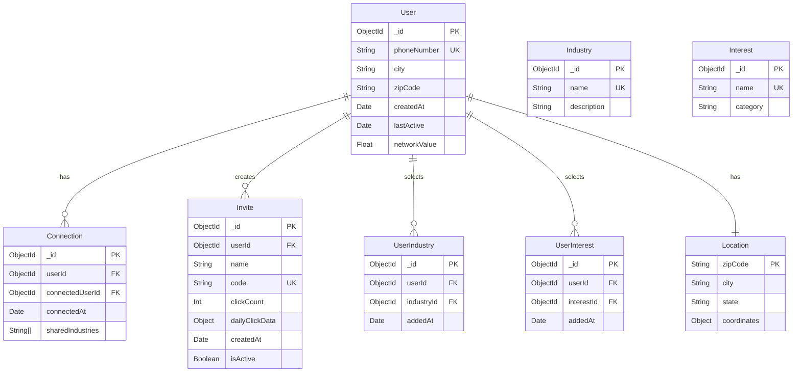

### 3.2.2 Indexing Strategy

| Collection | Index | Type | Purpose |
|------------|-------|------|---------|
| User | phoneNumber | Unique | Fast lookup during authentication |
| User | zipCode | Regular | Geolocation-based queries |
| Connection | userId, connectedUserId | Compound | Efficient connection lookups |
| Invite | code | Unique | Fast invite link validation |
| UserIndustry | userId, industryId | Compound | Quick industry filtering |

## 3.3 API DESIGN

### 3.3.1 RESTful Endpoints

| Endpoint | Method | Purpose | Request Body | Response |
|----------|--------|---------|--------------|----------|
| `/api/auth/verify` | POST | Initiate phone verification | `{ phoneNumber: string }` | `{ verificationId: string }` |
| `/api/auth/confirm` | POST | Confirm verification code | `{ verificationId: string, code: string }` | `{ token: string, user: User }` |
| `/api/user/profile` | GET | Fetch user profile | - | `{ user: User, networkValue: number }` |
| `/api/network/connections` | GET | Get user connections | - | `{ connections: Connection[] }` |
| `/api/invite/create` | POST | Generate invite link | `{ name: string }` | `{ invite: Invite }` |

### 3.3.2 WebSocket Events

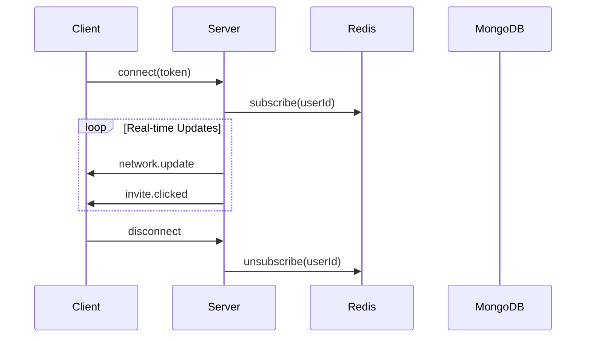

## 3.4 USER INTERFACE DESIGN

### 3.4.1 Welcome Page

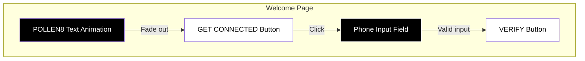

### 3.4.2 Profile Page

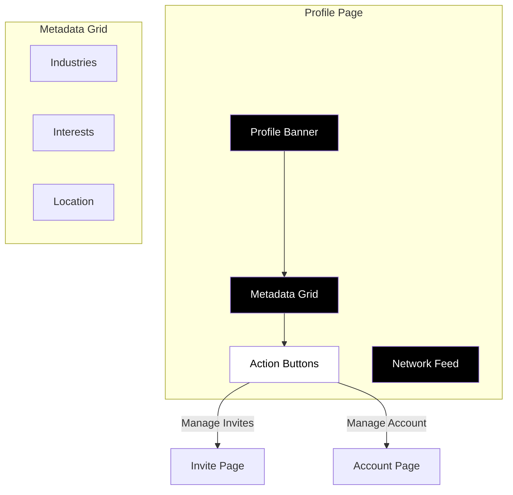

## 3.5 THEME DESIGN

### 3.5.1 Color Palette

| Element | Color | Hex Code | Usage |
|---------|-------|----------|-------|
| Background | Black | #000000 | Primary background color |
| Text | White | #FFFFFF | Primary text color |
| Accent | Light Gray | #EFEFEF | Secondary text, borders |
| Button (Primary) | White | #FFFFFF | Primary action buttons |
| Button Text | Black | #000000 | Text on primary buttons |

### 3.5.2 Typography

| Element | Font | Size | Weight | Style |
|---------|------|------|--------|-------|
| Headers (H1) | Proxima Nova | 30px | 600 | Capitalized |
| Headers (H2) | Proxima Nova | 25px | 400 | Regular |
| Body Text | Proxima Nova | 14px | 300 | Light |
| Button Text | Proxima Nova | 16px | 600 | Capitalized |
| Form Input | Proxima Nova | 18px | 600 | Uppercase |

### 3.5.3 Animation Specifications

| Element | Animation | Duration | Timing Function |
|---------|-----------|----------|-----------------|
| Welcome Text | Fade In | 3s | ease-in-out |
| Welcome Text | Fade Out | 1s | ease-out |
| Verify Button | Pulse | 4s | ease-in-out |
| Network Graph | Render | 1s | ease-in |
| Profile Banner | Star Constellation | Continuous | linear |

### 3.5.4 Component Styling

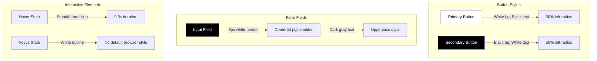

# 4. TECHNOLOGY STACK

## 4.1 PROGRAMMING LANGUAGES

| Language | Purpose | Justification |
|----------|---------|---------------|
| JavaScript (ES6+) | Frontend and backend development | - Full-stack consistency<br>- Rich ecosystem<br>- Excellent async handling<br>- Native JSON support |
| TypeScript | Type-safe development | - Enhanced code reliability<br>- Better IDE support<br>- Improved maintainability<br>- Interface-driven development |
| CSS | Styling (via Tailwind) | - Industry standard<br>- Necessary for UI implementation<br>- Tailwind utility classes |
| SQL | Database queries | - Robust data querying<br>- Complex relationship handling<br>- Data integrity maintenance |

## 4.2 FRAMEWORKS AND LIBRARIES

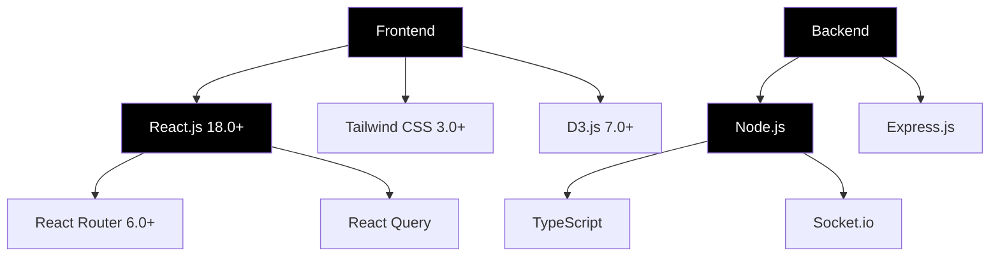

| Category | Technology | Version | Purpose |
|----------|------------|---------|---------|
| Frontend Core | React.js | 18.0+ | - Component-based UI development<br>- Virtual DOM for performance<br>- Extensive ecosystem |
| Styling | Tailwind CSS | 3.0+ | - Utility-first styling<br>- Consistent design system<br>- Responsive design support |
| Visualization | D3.js | 7.0+ | - Network graph rendering<br>- Interactive data visualizations<br>- SVG manipulation |
| Backend Core | Node.js | 16.0+ | - JavaScript runtime<br>- High-performance I/O<br>- NPM package ecosystem |
| API Framework | Express.js | 4.0+ | - RESTful API development<br>- Middleware support<br>- Route handling |
| Real-time | Socket.io | 4.0+ | - WebSocket connections<br>- Real-time updates<br>- Fallback mechanisms |

## 4.3 DATABASES

| Database | Type | Purpose | Key Features |
|----------|------|---------|--------------|
| MongoDB | NoSQL | Primary data store | - Flexible schema<br>- Horizontal scaling<br>- Rich query API<br>- Geospatial indexing |
| Redis | In-memory | Caching & sessions | - Fast data access<br>- Pub/Sub capabilities<br>- Session management<br>- Leaderboard functionality |
| PostgreSQL | Relational | Analytics data | - Complex queries<br>- ACID compliance<br>- JSON support<br>- Full-text search |

## 4.4 THIRD-PARTY SERVICES

| Service | Purpose | Integration Method | Key Features |
|---------|---------|-------------------|--------------|
| Twilio | SMS verification | REST API | - Phone number validation<br>- SMS delivery<br>- Delivery status tracking |
| Google Maps API | Geolocation services | JavaScript SDK | - ZIP code validation<br>- City auto-population<br>- Location-based features |
| AWS S3 | Static asset storage | SDK | - Scalable storage<br>- CDN integration<br>- High availability |
| Cloudflare | CDN & security | DNS & proxy | - DDoS protection<br>- SSL/TLS encryption<br>- Edge caching |
| Sentry | Error tracking | SDK | - Real-time error reporting<br>- Performance monitoring<br>- Issue tracking |

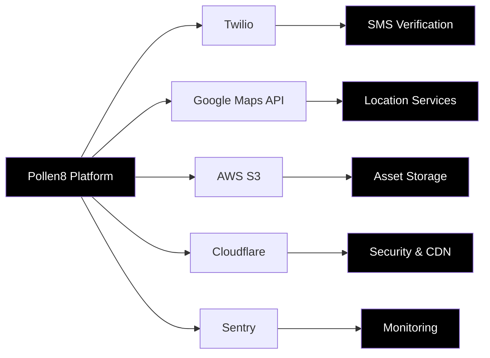

# 5. SECURITY CONSIDERATIONS

## 5.1 AUTHENTICATION AND AUTHORIZATION

### 5.1.1 Authentication Flow

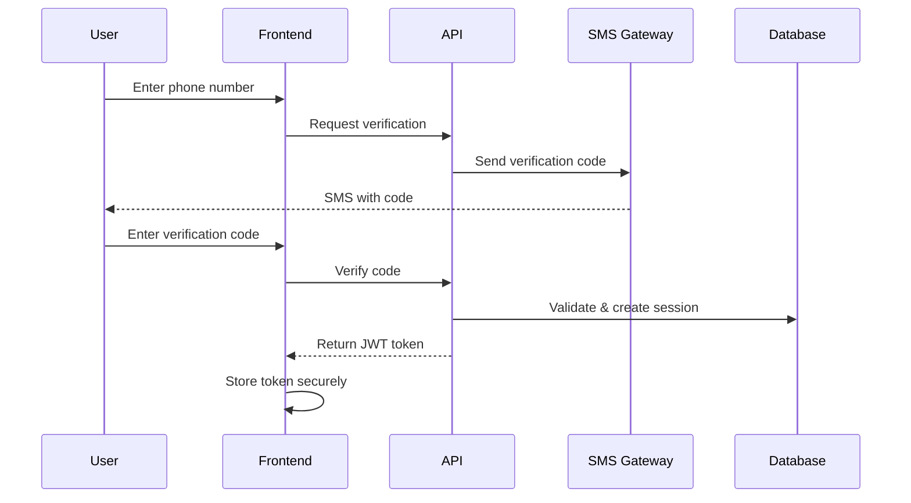

### 5.1.2 Authorization Levels

| Role | Permissions | Access Scope |
|------|-------------|--------------|
| User | - Manage own profile<br>- Create/manage connections<br>- Generate invite links<br>- View own analytics | - Personal profile data<br>- Direct connections<br>- Own invite analytics |
| Admin | - All user permissions<br>- Access system analytics<br>- Manage user accounts<br>- Configure system settings | - All user data<br>- System configuration<br>- Analytics dashboard |
| System | - Automated processes<br>- Data aggregation<br>- Maintenance tasks | - All database access<br>- System resources |

### 5.1.3 Token Management

| Aspect | Implementation | Details |
|--------|----------------|---------|
| Token Type | JWT (JSON Web Token) | - RS256 signing algorithm<br>- 24-hour expiration<br>- Refresh token rotation |
| Storage | HttpOnly Cookies | - Secure flag enabled<br>- SameSite=Strict<br>- Domain-restricted |
| Renewal | Silent refresh mechanism | - Background token renewal<br>- Grace period for expiration |

## 5.2 DATA SECURITY

### 5.2.1 Encryption Standards

| Data State | Encryption Method | Key Management |
|------------|-------------------|----------------|
| In Transit | TLS 1.3 | - Automatic rotation<br>- Perfect Forward Secrecy |
| At Rest | AES-256-GCM | - Hardware Security Module<br>- Key rotation every 90 days |
| In Memory | Secure memory handling | - Data wiping after use<br>- Memory encryption |

### 5.2.2 Data Classification

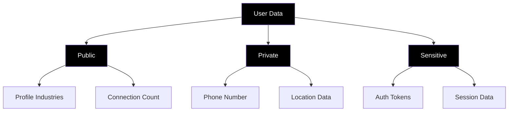

### 5.2.3 Data Protection Measures

| Data Type | Protection Measure | Implementation |
|-----------|-------------------|-----------------|
| Phone Numbers | Hashing | - Argon2 algorithm<br>- Salted hashes |
| Personal Info | Encryption | - Field-level encryption<br>- Encrypted search |
| Analytics Data | Anonymization | - Data aggregation<br>- Identifier removal |

## 5.3 SECURITY PROTOCOLS

### 5.3.1 API Security

| Measure | Implementation | Purpose |
|---------|----------------|---------|
| Rate Limiting | - 100 requests/min per IP<br>- 1000 requests/min per user | Prevent brute force and DoS attacks |
| Input Validation | - JSON Schema validation<br>- Sanitization middleware | Prevent injection attacks |
| Output Encoding | - Context-specific encoding<br>- Content Security Policy | Prevent XSS attacks |

### 5.3.2 Monitoring and Incident Response

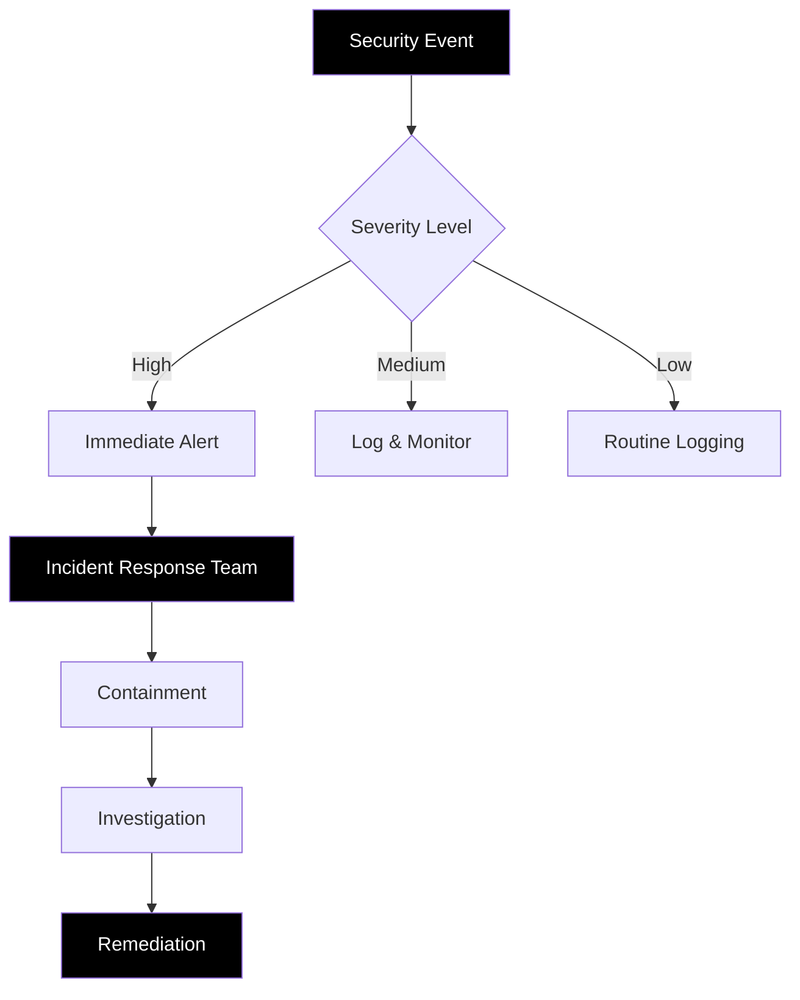

### 5.3.3 Security Testing

| Test Type | Frequency | Tools |
|-----------|-----------|-------|
| Penetration Testing | Quarterly | - Burp Suite<br>- OWASP ZAP |
| Vulnerability Scanning | Weekly | - Snyk<br>- SonarQube |
| Security Audits | Bi-annually | - Manual code review<br>- Third-party auditors |

### 5.3.4 Compliance Standards

| Standard | Implementation | Verification |
|----------|----------------|--------------|
| GDPR | - Data minimization<br>- Right to be forgotten<br>- Data portability | Annual compliance audit |
| CCPA | - Data disclosure<br>- Opt-out mechanisms | Quarterly self-assessment |
| SOC 2 Type II | - Access controls<br>- Encryption standards<br>- Monitoring practices | Annual certification |

### 5.3.5 Secure Development Lifecycle


| Phase | Security Measures |
|-------|-------------------|
| Planning | - Threat modeling<br>- Security requirements definition |
| Development | - Secure coding guidelines<br>- Code analysis tools |
| Testing | - Security testing automation<br>- Vulnerability assessments |
| Deployment | - Secure configuration management<br>- Deployment security checks |
| Maintenance | - Security patch management<br>- Continuous monitoring |

# 6. INFRASTRUCTURE

## 6.1 DEPLOYMENT ENVIRONMENT

The Pollen8 platform utilizes a cloud-native deployment strategy to ensure scalability, reliability, and optimal performance.

| Environment | Purpose | Configuration |
|-------------|---------|---------------|
| Development | Local development and testing | - Docker containers on developer machines<br>- Local MongoDB and Redis instances<br>- Mock SMS and geolocation services |
| Staging | Pre-production testing and validation | - AWS cloud environment<br>- Mirrors production setup<br>- Reduced resource allocation |
| Production | Live user-facing environment | - AWS cloud environment<br>- High-availability configuration<br>- Auto-scaling enabled |

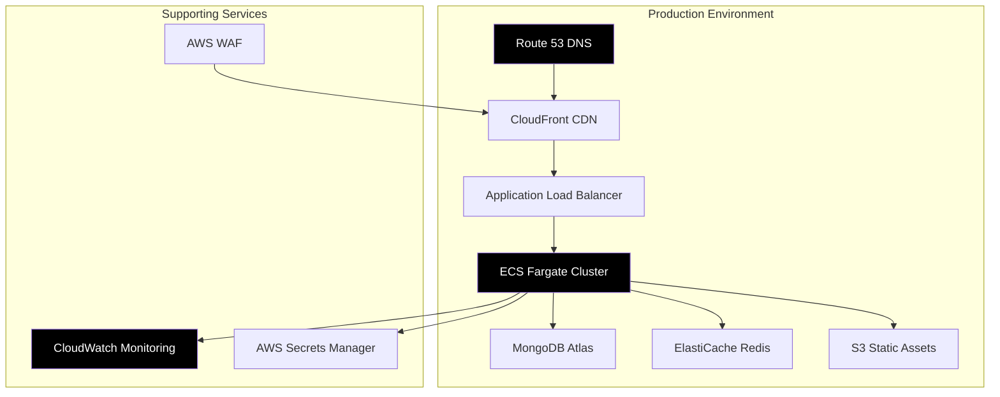

## 6.2 CLOUD SERVICES

| Service | Provider | Purpose | Justification |
|---------|----------|---------|---------------|
| Compute | AWS ECS Fargate | Container orchestration | - Serverless container management<br>- Automatic scaling<br>- Pay-per-use pricing model |
| Database | MongoDB Atlas | Primary data storage | - Managed MongoDB service<br>- Multi-region deployment<br>- Automated backups and scaling |
| Caching | AWS ElastiCache | Redis caching layer | - Managed Redis service<br>- High availability<br>- Sub-millisecond latency |
| CDN | AWS CloudFront | Content delivery | - Global edge network<br>- HTTPS termination<br>- DDoS protection |
| DNS | AWS Route 53 | Domain management | - Health checks<br>- Latency-based routing<br>- Integration with other AWS services |
| Monitoring | AWS CloudWatch | System monitoring | - Centralized logging<br>- Custom metrics<br>- Automated alerting |

## 6.3 CONTAINERIZATION

The application utilizes Docker for containerization to ensure consistency across environments and simplified deployment.

### 6.3.1 Container Architecture

```mermaid
graph LR
    subgraph Docker Containers
        A[Frontend Nginx]
        B[Backend Node.js]
        C[Socket.io Server]
    end
    
    subgraph Shared Resources
        D[MongoDB]
        E[Redis]
    end
    
    A --> B
    B --> D
    B --> E
    C --> D
    C --> E
    
    style A fill:#000000,color:#ffffff
    style B fill:#000000,color:#ffffff
    style C fill:#000000,color:#ffffff
```

### 6.3.2 Container Specifications

| Container | Base Image | Exposed Ports | Resource Limits |
|-----------|------------|---------------|-----------------|
| Frontend | nginx:alpine | 80 | CPU: 0.5, Memory: 512MB |
| Backend | node:16-alpine | 3000 | CPU: 1.0, Memory: 1GB |
| Socket.io | node:16-alpine | 3001 | CPU: 1.0, Memory: 1GB |

## 6.4 ORCHESTRATION

AWS ECS with Fargate is used for container orchestration, providing serverless container management.

### 6.4.1 ECS Configuration

| Component | Configuration | Purpose |
|-----------|---------------|---------|
| Task Definition | - Frontend container<br>- Backend container<br>- Socket.io container | Defines container specifications and resource requirements |
| Service | - Desired count: 2<br>- Minimum healthy percent: 100<br>- Maximum percent: 200 | Ensures high availability and smooth deployments |
| Auto Scaling | - Target CPU utilization: 70%<br>- Min instances: 2<br>- Max instances: 10 | Automatically adjusts capacity based on demand |

### 6.4.2 Load Balancing

```mermaid
graph TD
    A[Application Load Balancer] --> B[Target Group 1]
    A --> C[Target Group 2]
    B --> D[ECS Tasks - Frontend]
    C --> E[ECS Tasks - Backend]
    
    subgraph Auto Scaling
        F[CloudWatch Alarms]
        G[Scaling Policies]
    end
    
    F --> G
    G --> D
    G --> E
    
    style A fill:#000000,color:#ffffff
    style D fill:#000000,color:#ffffff
    style E fill:#000000,color:#ffffff
```

## 6.5 CI/CD PIPELINE

### 6.5.1 Pipeline Overview

```mermaid
graph LR
    A[GitHub Repository] --> B[AWS CodePipeline]
    B --> C[CodeBuild - Build]
    C --> D[CodeBuild - Test]
    D --> E{Approval}
    E -->|Auto: Staging| F[Deploy to Staging]
    E -->|Manual: Prod| G[Deploy to Production]
    
    style A fill:#000000,color:#ffffff
    style B fill:#000000,color:#ffffff
    style F fill:#000000,color:#ffffff
    style G fill:#000000,color:#ffffff
```

### 6.5.2 Pipeline Stages

| Stage | Tools | Actions | Success Criteria |
|-------|-------|---------|------------------|
| Source | GitHub | - Code checkout<br>- Webhook trigger | - Successful repository clone |
| Build | AWS CodeBuild | - Install dependencies<br>- Run linting<br>- Compile TypeScript<br>- Build Docker images | - All builds successful<br>- No linting errors |
| Test | AWS CodeBuild | - Run unit tests<br>- Run integration tests<br>- Security scan | - 100% test pass rate<br>- No security vulnerabilities |
| Deploy (Staging) | AWS ECS | - Update ECS task definitions<br>- Deploy to staging environment<br>- Run smoke tests | - Successful deployment<br>- All smoke tests pass |
| Approval | Manual/Automated | - Automated for staging<br>- Manual approval for production | - Required approvals received |
| Deploy (Production) | AWS ECS | - Blue/Green deployment to production<br>- Health checks<br>- Rollback capability | - Successful deployment<br>- All health checks pass |

### 6.5.3 Deployment Strategy

| Aspect | Implementation | Details |
|--------|----------------|---------|
| Blue/Green Deployment | AWS ECS | - Deploy new version alongside existing<br>- Gradually shift traffic<br>- Quick rollback capability |
| Health Checks | ALB & Route 53 | - HTTP health check endpoints<br>- DNS failover configuration |
| Rollback Procedure | Automated | - Automatic rollback on failed deployment<br>- Manual rollback option available |
| Monitoring | CloudWatch | - Deployment success rate<br>- Error rate monitoring<br>- Performance impact tracking |

# 8. APPENDICES

## 8.1 Additional Technical Information

### 8.1.1 Browser Compatibility

| Browser | Minimum Version | Notes |
|---------|-----------------|-------|
| Chrome | 83+ | Full support for all features |
| Firefox | 78+ | May have minor animation differences |
| Safari | 13.1+ | Requires WebKit prefixes for some CSS |
| Edge | 84+ | Full support for all features |

### 8.1.2 Performance Benchmarks

```mermaid
graph LR
    A[Client Request] -->|200ms| B[API Gateway]
    B -->|100ms| C[Application Logic]
    C -->|50ms| D[Database Query]
    D -->|50ms| E[Response Processing]
    E -->|100ms| F[Client Rendering]
    
    style A fill:#000000,color:#ffffff
    style C fill:#000000,color:#ffffff
    style F fill:#000000,color:#ffffff
```

| Operation | Target Time | Maximum Acceptable |
|-----------|-------------|-------------------|
| Initial Page Load | 1.5s | 3s |
| API Response | 200ms | 500ms |
| Network Graph Render | 500ms | 1s |
| SMS Code Delivery | 5s | 15s |

### 8.1.3 Third-Party Dependencies

| Dependency | Version | Purpose | License |
|------------|---------|---------|---------|
| Twilio | 3.x | SMS verification | Commercial |
| Google Maps API | Latest | ZIP code validation | Commercial |
| AWS SDK | 3.x | S3 storage for assets | Apache 2.0 |
| Socket.io | 4.x | Real-time updates | MIT |

## 8.2 Glossary

| Term | Definition |
|------|------------|
| Network Constellation | An animated star-like pattern displayed in the profile banner representing user connections |
| Verification Flow | The process of validating a user's phone number through SMS code entry |
| Click Analytics | Tracking and visualization of invite link engagement over time |
| Network Feed | A dynamic display of updates and activities from a user's connections |
| Growth Tracking | Visual representation of a user's network expansion over time |
| Industry Focus | The practice of categorizing and filtering connections by professional sector |
| Responsive Grid | A layout system that automatically adjusts based on screen size and device type |

## 8.3 Acronyms

| Acronym | Expanded Form | Context |
|---------|---------------|---------|
| CDN | Content Delivery Network | Used for distributing static assets globally |
| CSS | Cascading Style Sheets | Styling language used with Tailwind |
| D3 | Data-Driven Documents | JavaScript library for data visualizations |
| HTML | HyperText Markup Language | Base markup for web pages |
| HTTP | HyperText Transfer Protocol | Protocol for data communication on the web |
| IDE | Integrated Development Environment | Tools used for code development |
| JSON | JavaScript Object Notation | Data format for API communication |
| REST | Representational State Transfer | Architectural style for API design |
| SDK | Software Development Kit | Tools for integrating third-party services |
| SQL | Structured Query Language | Language for database operations |
| SVG | Scalable Vector Graphics | Format used for network visualizations |
| URL | Uniform Resource Locator | Format for web addresses and invite links |

## 8.4 Development Environment Setup

```mermaid
graph TD
    A[Development Tools] --> B[Code Editor]
    A --> C[Version Control]
    A --> D[Package Manager]
    A --> E[Testing Framework]
    
    B --> F[VS Code]
    C --> G[Git]
    D --> H[npm]
    E --> I[Jest]
    
    J[Development Process] --> K[Local Server]
    J --> L[Hot Reloading]
    J --> M[Debug Tools]
    
    style A fill:#000000,color:#ffffff
    style J fill:#000000,color:#ffffff
    style F fill:#000000,color:#ffffff
    style I fill:#000000,color:#ffffff
```

### Required Development Tools

| Tool | Version | Purpose |
|------|---------|---------|
| Node.js | 16.x LTS | JavaScript runtime |
| npm | 8.x | Package management |
| Git | 2.x | Version control |
| VS Code | Latest | Code editing |
| Chrome DevTools | Latest | Debugging |
| Postman | Latest | API testing |

## 8.5 API Response Examples

### User Profile Response
```json
{
  "user": {
    "id": "u123456",
    "industries": ["Technology", "Finance", "Education"],
    "interests": ["AI", "Blockchain", "EdTech"],
    "location": {
      "city": "New York",
      "zipCode": "10001"
    },
    "networkValue": 15.7,
    "connectionCount": 5
  }
}
```

### Invite Analytics Response
```json
{
  "invite": {
    "id": "i789012",
    "name": "Tech Conference 2023",
    "url": "https://pollen8.com/i/tc2023",
    "clickCount": 45,
    "dailyClicks": {
      "2023-09-01": 12,
      "2023-09-02": 15,
      "2023-09-03": 18
    }
  }
}
```